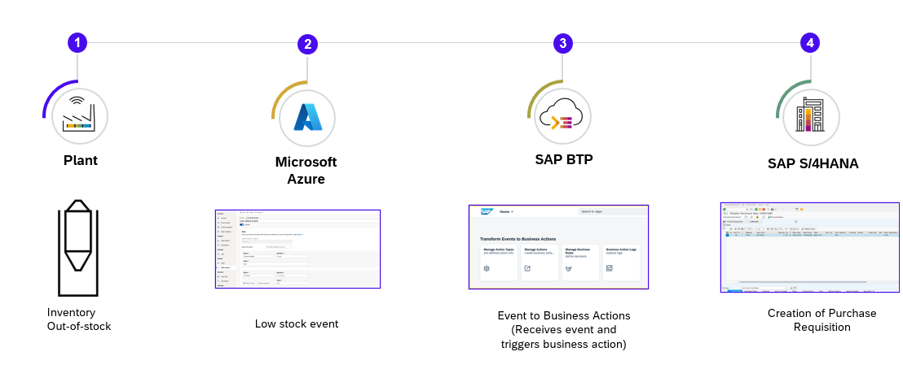

## Scenario

Microsoft Azure IoT Central is an IoT application platform (aPaaS) that simplifies the creation of IoT solutions. Azure IoT Central provides a ready-to-use UX and API surface built to connect, manage, and operate fleets of devices at scale. 

This describes a sample business scenario for building a reference application based on the event-driven application architecture.It extends the platform agnostic reference architecture to show how to integrate events from Azure IoT Central IoT Platform with SAP S/4HANA using message brokers and events.

In this reference architecture, events are received from the Azure IoT Central and the business actions for these events are triggered in SAP S/4HANA. The events from Azure IoT Central are sent to SAP Integration Suite, advanced event mesh using the data export functionality in Azure IoT Central Application. The Node.js extension application deployed in SAP BTP subscribes to the SAP Advanced Event Mesh queue and executes the action that is required to be taken based on the event details. SAP Event Mesh capability in SAP Integration Suite can also be leveraged for integration. The choice of the eventing service can be based on the scenario and volume of events to be handled.

## Business Process Flow

In this event-driven scenario, based on the real-time status of the IoT Devices from Azure IoT Central, actionable events are sent to SAP BTP to decide on the critical business actions to be taken in the SAP business applications based on business rules defined in the system.

1. Data from IoT Devices are sent to Azure IoT Central which includes all the streaming data from the devices.

2. Based on the rules in Azure IoT Central, the data is published to SAP Integration Suite, advanced event mesh that require attention. The criteria is configured in IoT Rules in the IoT Platform. Similar decisions can be configured in other systems and applications as well.

3. SAP BTP acts as a consumer. Once the event details are received, the SAP BTP extension application which is configured with all necessary actions executes the respective chain. For example, configuring decisions in SAP Build Process Automation to decide on the action to be taken, executing the chain of actions that to be taken based on the event received, or configuring OData API calls to be executed.

4. The extension application in SAP BTP executes the business actions in respective SAP business applications.

## Solution Architecture

The key services used by Microsoft Azure are the Azure IoT Central, Azure Blob Storage, Azure Event Grid and Microsoft Entra ID.

The services used by SAP BTP are the Cloud Foundry Runtime, SAP Integration Suite, advanced event mesh, SAP Connectivity service, SAP Private Link service, SAP Build Process Automation and SAP Destination service. 

SAP Private Link service is used for connectivity between SAP BTP and SAP S/4HANA when both systems are running on Microsoft Azure Infrastructure. Alternatively, you can use SAP Connectivity service and a cloud connector for integration of SAP BTP and SAP S/4HANA as well. 

**Option 1: Solution Architecture with SAP S/4HANA on Microsoft Azure and Private Link Service**

**Option 2: Solution Architecture with SAP S/4HANA on-premise or Public Cloud and Cloud Connector**

The following steps depict the information flow across systems (in both scenarios)

1. An application administrator logs into the SAP BTP extension application based on Events to Business Actions Framework via SAP Build Work Zone, advanced edition, to configure the business rules/decisions and the business actions that need to be triggered in business systems.

2. An event is triggered from the Azure IoT Central (in the case of the IoT scenario) or any other system.

3. These events are published to SAP Integration Suite, advanced event mesh. As the processor module's (part of the Events-to-Business-Action framework) endpoint subscribes to advanced event mesh, the event is received.

4. The Processor module (part of the Events-to-Business-Action framework) leverages the Decision capability of SAP Build Process Automation to initiate business actions, for example, purchase order requisition creation in SAP S/4HANA, based on characteristics of incoming events.

5. The defined action is triggered in SAP S/4HANA using the SAP Destination service and SAP Connectivity service leveraging cloud connector setup. In case SAP S/4HANA and SAP BTP are on the same Hyperscaler, communication with SAP S/4HANA happens via the SAP Private Link service.

## List of Services and Components

These are the technical prerequisites for integration between Azure IoT Central, SAP BTP and SAP S/4HANA. 

### Services in SAP BTP
- **Cloud Foundry Runtime**
    - Foundation for running the CAP extension application for translating events to business actions.
    - Required for the trust between Microsoft Azure Active Directory and SAP BTP
- **Authorization & Trust Management Service**
    - Required for securing the extension application in SAP BTP
- **SAP Integration Suite, advanced event mesh**
    - Required to receive events from Azure IoT Platform
- **SAP HANA Cloud**
    - Required to store action configuration and logs for CAP application
- **SAP Build Process Automation, Decisions**
    - Decisions are leveraged to configure business decisions that need to be taken based on the type of event received from Azure IoT Platform.

### Microsoft Azure

- **A valid Microsoft Azure subscription**
- **A Microsoft Azure Active Directory**
    - Required for the trust between Microsoft Azure Active Directory and SAP BTP
    - User management
    - Application registrations to allow access to Microsoft Azure IoT Central REST API and SAP BTP
- **An Azure IoT Central Service**
    - Service for configuring Azure IoT Central Application
    - Required for configuring device templates, event producers and event routing.

For detailed step by step information and to try out the integration, go to [GitHub Samples](https://github.com/SAP-samples/btp-events-to-business-actions-framework)
