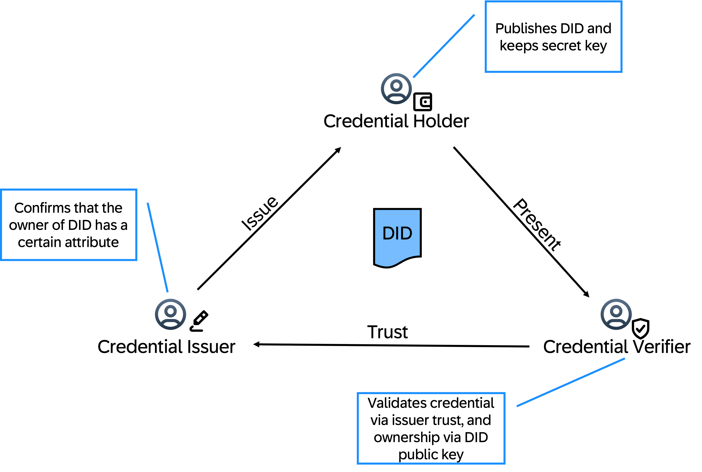
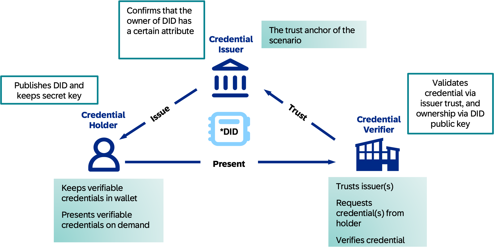

## Self-Sovereign Identities

### Introduction

**Self-Sovereign Identity (SSI) operates on a decentralized model, giving individuals control over their digital identities.**

- Individuals/Companies create their digital identity by generating private key (kept secure) and public key (shared)
- Trusted entities (a.k.a. issuers) issue digital credentials to the individual, cryptographically signed
- Individuals store credentials in a digital wallet that allows them to manage and control access
- To prove their identity or specific attributes, individuals present the relevant credentials to a verifier. The verifier checks the authenticity of the credentials using the issuer's public key

### Benefits

- **Enhanced Privacy:** Users have full control over their personal data and who can access it
- **Security:** SSI uses digital signatures to ensure that personal information is secure and tamper-proof
- **Decentralization:** SSI allows individuals to manage their identity credentials independently of centralized authorities
- **Efficiency:** Organizations can issue and verify credentials quickly and cost-effectively
- **Interoperability:** SSI enables seamless verification of digital identities across multiple platforms and locations

### Decentralized Identifiers (DID’s)

- A Decentralized Identifier (DID) is a globally unique identifier for the digital identity of an individual or company, independent of any central authority
- Each DID is associated with a DID Document, which contains information such as public keys, authentication protocols, and service endpoints. This - document is used to verify the DID and its associated credentials
- Depending on the use case, DIDs can be stored on a distributed ledger, ensuring that they are tamper-proof and not controlled by any single entity
- DIDs can be used across different platforms and services, for seamless verification of identities and credentials
- **DIDs represent a digital identity that can be referenced and verified without the need for a central orchestrator**

### Actors

| **Credential Issuer**                       | **Credential Holder**                        | **Credential Verifier**              |
| ------------------------------------------- | -------------------------------------------- | ------------------------------------ |
| - The trust anchor of the scenario          | - Keeps verifiable credentials in wallet     | - Trusts issuer(s)                   |
| - Issues and revokes verifiable credentials | - Presents verifiable credentials on demands | - Requests credential(s) from holder |
|                                             |                                              | - Verifies credential                |

## Decentralized Identity Verification (DIV)

The [Decentralized Identity Verification](https://www.sap.com/products/technology-platform/decentralized-identity-verification.html) service for SAP BTP enables enterprise applications to leverage **Self-Sovereign Identity (SSI)** for secure, privacy-preserving inter-company communications. DIV provides a comprehensive platform to issue, sign, verify, and manage **Verifiable Credentials (VCs)** and **Decentralized Identifiers (DIDs)** — the foundational building blocks of decentralized trust networks. It provides you with a user-friendly administration application and a service instance for API integration tasks.

DIV was development in the context of the data sovereignty requirements of [Catena-X](https://catena-x.net/en/) and [Gaia-X](https://www.data-infrastructure.eu/GAIAX/Navigation/EN/Home/home.html). The basis for DIV was created by ICN and brought to the first release by a joint development project of [ICN](https://sap.sharepoint.com/teams/ICNBerlinPotsdam) and BTP-Foundation.

Decentralized Identity Verification consists of three main pillars:

- **Decentralized Identity Management** — create, anchor, and manage company DIDs on supported networks
- **Verifiable Credential Lifecycle** — issue, sign, verify, present, and revoke W3C-compliant Verifiable Credentials
- **Trust Network Management** — manage trusted partners, trusted issuers, and credential schemas to form a verifiable business network

## Architecture

In the context of an SAP landscape, companies need to exchange data and prove facts about themselves and their products without relying on a central authority. DIV provides the SSI infrastructure for this by acting as the **trust anchor and credential management layer** on top of SAP BTP.

DIV integrates with SAP BTP platform services for security: **SAP Cloud Identity Services** for authentication and authorization and the **Audit Log Service** for compliance-grade logging of all sensitive operations.

The reference architectures in this section describe the most common integration patterns:

- [Verifiable Credential Issuance and Verification](./1-vc-issuance-and-verification/readme.md)
- [Bring Your Own Wallet](./2-bring-your-own-wallet/readme.md)
- [Product Carbon Footprint Use Case](./3-product-carbon-footprint-use-case/readme.md)

## Services and Components

- [Decentralized Identity Verification (Product Page)](https://www.sap.com/products/technology-platform/decentralized-identity-verification.html)
- [Decentralized Identity Verification (SAP Help Portal)](https://help.sap.com/docs/DECENTRALIZED_IDENTITY_VERIFICATION)

## Resources

- [W3C Verifiable Credentials Data Model](https://www.w3.org/TR/vc-data-model/)
- [Decentralized Identifiers (DIDs) W3C Spec](https://www.w3.org/TR/did-core/)
- [IATP – Interoperability and Trust Protocol (Catena-X)](https://github.com/eclipse-tractusx/identity-trust)
